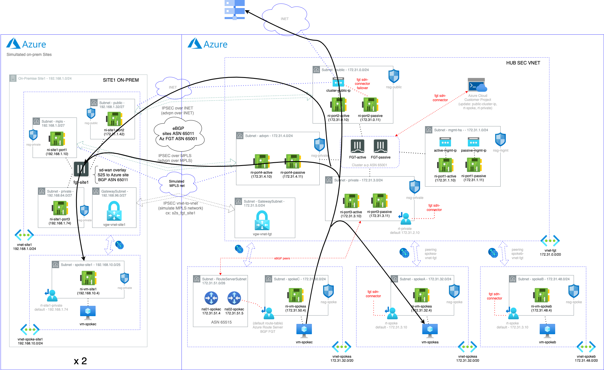

# Deployment of a FortiGate-VM (BYOL/PAYG) Cluster on the Azure with Terraform
## Introduction
### This topology is only recommended for using with FOS 7.0.5 and later, since FSO 7.0 3 ports only HA setup is supported.
* port1 - hamgmt/hasync
* port2 - public/untrust
* port3 - private/trust
* port4 - sdwan/advpn

A Terraform script to deploy a FortiGate-VM Cluster on Azure

## Requirements
* [Terraform](https://learn.hashicorp.com/terraform/getting-started/install.html) >= 0.12.0
* Terraform Provider AzureRM >= 2.24.0
* Terraform Provider Template >= 2.2.0
* Terraform Provider Random >= 3.1.0

## License
- The terms for the FortiGate PAYG or BYOL image in the Azure Marketplace needs to be accepted once before usage. This is done automatically during deployment via the Azure Portal. For the Azure CLI the commands below need to be run before the first deployment in a subscription.
  - BYOL
`az vm image terms accept --publisher fortinet --offer fortinet_fortigate-vm_v5 --plan fortinet_fg-vm`
  - PAYG
`az vm image terms accept --publisher fortinet --offer fortinet_fortigate-vm_v5 --plan fortinet_fg-vm_payg_2022`

## Deployment overview
Terraform deploys the following components:
   - Azure Virtual Network (vnet) with 4 subnets as hub vnet (subnets: mgmt-ha, public, private and advpn).
   - Two vnet as spokes peered with firewall vnet (vnet-spokea, vnet-spokeb), route tables updated by Fortinet SDN-Connector.
   - One vnet as spoke peered with firewall vnet (vnet-spokec), route tables updated by Azure Route Server with BGP session with firewall cluster.
   - Two FortiGate-VM (BYOL/PAYG) instances with four NICs in HA active/passive (default PAYG)
   - Firewalls rules to allow traffic E-W spokes, E-W spoke-onprem, N-S spoke-public and E-W spoke sites connected with ADVPN.
   - IPSEC connections using ADVPN to on-premise firewalls (config example for on-prem device should be completed and applied manualy).
   - Three Ubuntu Client instance in spokes vnet subnets.
   - eBGP peering among cluster and Azure Route Server instances, fortigate cluster announcing default route to vnet-spokec.
   - eBGP routing between on-prem spoke sites over the advpn tunnels.
   - 3 publics IPs:
      - 2 public IPs for fortigate units management
      - 1 cluster public IP for Internet access (cluster-public-ip, this IP is shared between cluster and updated by SDN Connector in case of failure)
   - Two complete remote sites (site1 and site2) deployed on Azure as well, acting as remote on-prem sites for testing.
      - 1 FGT VM in each site for ADVPN to HUB
      - 1 vnet network with 3 subnets (public, private and mgmt/ha)
      - 1 vnet network with 1 subnets (spoke-site) for test virtual machine peered with FGT vnet
      - 1 test vm for testing
      - Fortigate SDWAN interface overlay with IPSEC tunnels to Azure over INET and simulated MPLS underlay

## Deployment considerations:
      - Azure Route Server could take over 10min to complete
      - Virtual Netwok Gateway could take over 20min to complete
      - You will be charged for this deployment

## Diagram solution



## Deployment
To deploy the FortiGate-VM to Azure:
1. Clone the repository.
2. Customize variables in the `terraform.tfvars.example` and `variables.tf` file as needed.  And rename `terraform.tfvars.example` to `terraform.tfvars`.
3. Initialize the providers and modules:
   ```sh
   $ cd XXXXX
   $ terraform init
    ```
4. Submit the Terraform plan:
   ```sh
   $ terraform plan
   ```
5. Verify output.
6. Confirm and apply the plan:
   ```sh
   $ terraform apply
   ```
7. If output is satisfactory, type `yes`.

Output will include the information necessary to log in to the FortiGate-VM instances:
```sh
Outputs:

a_ResourceGroup = <Resource Group>
b_clusterPublicIP = <Cluster Public IP>
c_ActiveMGMTPublicIP = <Active FGT Management URL Public IP>
d_PassiveMGMTPublicIP = <Passive FGT Management URL Public IP>
e_TestVMSpokeAIP = <SpokeA VM IP>
f_TestVMSpokeBIP = <SpokeB VM IP>
g_TestVMSpokeCIP = <SpokeC VM IP>
h_Username = <FGT user and TestVM>
i_Password = <FGT Password and TestVM>
j_ipsec-psk-key = <IPSEC PSK key>
k_advpn-public-ip = <Cluster Public IP for ADVPN>
l_Site1MGMTIP = <Site1 FGT Management URL Public IP>
m_Site2MGMTIP = <Site2 FGT Management URL Public IP>
n_TestVMSite1IP = <Site1 spoke VM IP>
o_TestVMSite2IP = <Site2 spoke VM IP>
```

## Destroy the instance
To destroy the instance, use the command:
```sh
$ terraform destroy
```

# Support
This a personal repository with goal of testing and demo Fortinet solutions on the Cloud. No support is provided and must be used by your own responsability. Cloud Providers will charge for this deployments, please take it in count before proceed.

## License
Based on Fortinet repositories with original [License](https://github.com/fortinet/fortigate-terraform-deploy/blob/master/LICENSE) © Fortinet Technologies. All rights reserved.

