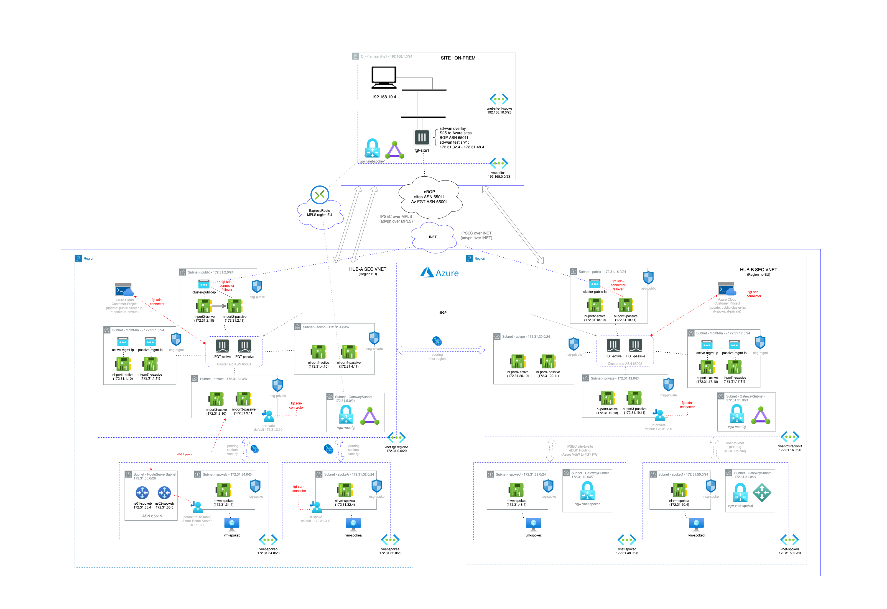

# Deployment of a FortiGate-VM (BYOL/PAYG) Cluster on the Azure with Terraform
## Introduction
### This topology is only recommended for using with FOS 7.0.5 and later, since FSO 7.0 3 ports only HA setup is supported.
* port1 - hamgmt/hasync
* port2 - public/untrust
* port3 - private/trust
* port4 - sdwan/advpn

A Terraform script to deploy a FortiGate-VM Cluster on Azure

## Requirements
* [Terraform](https://learn.hashicorp.com/terraform/getting-started/install.html) >= 0.12.0
* Terraform Provider AzureRM >= 2.24.0
* Terraform Provider Template >= 2.2.0
* Terraform Provider Random >= 3.1.0

## Deployment overview
Terraform deploys the following components:

1 x in region A (default FranceCentral) as HUB A with a cluster of fortigates:
   - Azure Virtual Network (vnet) with 4 subnets as hub vnet (subnets: mgmt-ha, public, private and advpn).
   - Two vnets as spoke peered with firewall vnet (vnet-spoke-1, vnet-spoke-2). Spoke-2 route table is updated by Fortinet SDN-Connector and Spoke-1 route table is updated by Azure Route Server BGP peered with fortigate cluster. 
   - Two FortiGate-VM (BYOL/PAYG) instances with four NICs in HA active/passive (default PAYG)
   - Firewalls rules to allow traffic E-W spokes, E-W spoke-onprem, N-S spoke-public and E-W spoke sites connected with ADVPN.
   - IPSEC connections using ADVPN to on-premise firewalls (config example for on-prem device should be completed and applied manualy).
   - Two Ubuntu Client instance in spokes vnet subnets.
   - eBGP routing between on-prem spoke sites over the advpn tunnels.

1 x in region B as HUB B (default East US 2) with a cluster of fortigates:
   - Clone deployment in region A HUB A

1 x in region A as site 1 with a single fortigate instance:
   - One remote site (site1) deployed on Azure as well, acting as remote on-prem sites for testing.
   - MPLS connection (ExpressRoute) is simulated using and IPSEC tunnel against fortigate vnet using Virtual Network Gateways.
      - 1 FGT VM in each site for ADVPN to HUB
      - 1 vnet network with 3 subnets (public, private and mgmt/ha)
      - 1 vnet network with 1 subnet (subnet-spoke-1-vm) for test virtual machine peered with FGT vnet
      - 1 test vm for testing
      - Fortigate SDWAN interface overlay with IPSEC tunnels to Azure over INET and simulated MPLS underlay


## Deployment considerations:
      - Azure Route Server could take over 10min to complete
      - Virtual Netwok Gateway could take over 20min to complete
      - If "terraform apply" fails because a timeout, just apply it again and will complete the deployment. 
      - You will be charged for this deployment

## Diagram solution



## Deployment
To deploy the FortiGate-VM to Azure:
1. Clone the repository.
2. Customize variables in the `terraform.tfvars.example` and `variables.tf` file as needed.  And rename `terraform.tfvars.example` to `terraform.tfvars`.
3. Initialize the providers and modules:
   ```sh
   $ cd XXXXX
   $ terraform init
    ```
4. Submit the Terraform plan:
   ```sh
   $ terraform plan
   ```
5. Verify output.
6. Confirm and apply the plan:
   ```sh
   $ terraform apply
   ```
7. If output is satisfactory, type `yes`.

Output will include the information necessary to log in to the FortiGate-VM instances:
```sh
Outputs:

regionA-ResourceGroup = <Resource Group Region A>
regionB-ResourceGroup = <Resource Group Region B>
za-fgt-active-mgmt-url = <Active FGT Management URL Public IP Region A>
za-fgt-passive-mgmt-url = <Passive FGT Management URL Public IP Region A>
zb-fgt-active-mgmt-url = <Active FGT Management URL Public IP Region B>
zb-fgt-passive-mgmt-url = <Passive FGT Management URL Public IP Region B>
site-fgt-mgmt-ip_url = <FGT Managemnet URL Public IP Region A>
za-TestVM-spoke-1-ip = <Spoke 1 VM IP Region A>
za-TestVM-spoke-1-ip = <Spoke 2 VM IP Region A>
zb-TestVM-spoke-1-ip = <Spoke 1 VM IP Region B>
zb-TestVM-spoke-1-ip = <Spoke 2 VM IP Region B>
TestVM-site-ip = <Test VM IP site Region A>
h_Username = <FGT user and TestVM>
i_Password = <FGT Password and TestVM>
advpn_ipsec-psk-key = <PSK for ADVPN>
```

## Destroy the instance
To destroy the instance, use the command:
```sh
$ terraform destroy
```

# Support
This a personal repository with goal of testing and demo Fortinet solutions on the Cloud. No support is provided and must be used by your own responsability. Cloud Providers will charge for this deployments, please take it in count before proceed.

## License
Based on Fortinet repositories with original [License](https://github.com/fortinet/fortigate-terraform-deploy/blob/master/LICENSE) © Fortinet Technologies. All rights reserved.

